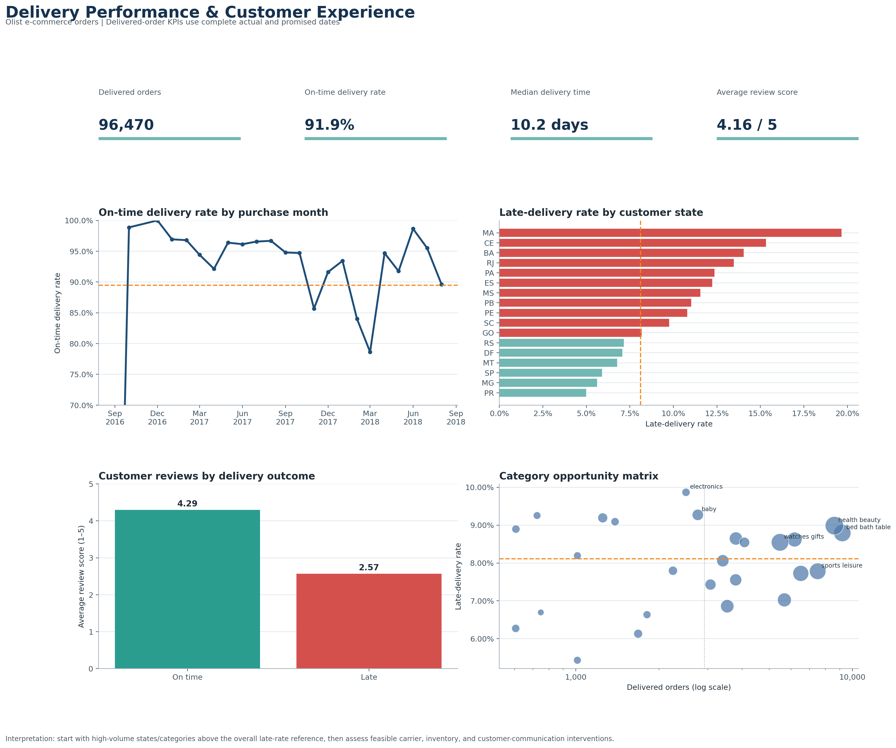

# Delivery Performance & Customer Experience Analytics

This portfolio project turn order, shipping, payment, and review records into a reliable delivery-performance dataset and an operational dashboard.

This project adds the skills often requested in entry-level analyst job descriptions: SQL reporting, data validation, KPI design, and operational decision support. The delivery focus also makes practical use of your transportation and logistics experience.



## Results at a glance

| Measure | Result |
| --- | --- |
| Order rows transformed | **99,441** |
| Delivered orders with complete dates | **96,470** |
| On-time delivery rate | **91.9%** |
| Average review — on time vs. late | **4.29 vs. 2.57 / 5** |
| Lowest monthly on-time rate | **78.6%** in March 2018 |

## Key findings and recommendations

- **Delivery reliability has a clear customer-experience link.** Late orders received an average review score of 2.57, compared with 4.29 for on-time orders. Delivery reliability should be treated as a customer-retention issue, not only an operations metric.
- **Performance is volatile under pressure.** The on-time rate reached its low point of 78.6% in March 2018 after a period of elevated order volume. Investigate carrier capacity, fulfillment handoffs, and customer communications for similar peak periods.
- **Regional prioritization should be volume-aware.** Among states with at least 500 delivered orders, Massachusetts had the highest late-delivery rate (19.7%, 717 orders), followed by Ceará (15.3%, 1,279 orders). These are investigation leads, not evidence of root cause.
- **Use the category matrix to target high-impact follow-up.** Prioritize categories that combine above-average late rates with high order volume or merchandise-and-freight value, then validate whether inventory, seller, or carrier factors explain the pattern.
## Business scenario

An e-commerce operations leader wants to know where the customer delivery experience is breaking down. The dashboard and analysis should answer:

1. What share of delivered orders arrive on or before the promised date, and is that changing month to month?
2. Which customer states and product categories have the longest delivery times or the highest late-delivery rates?
3. How do freight cost, order value, review score, and delivery timeliness move together?

The goal is to identify concrete opportunities—such as a state/category combination with an above-average late rate—not merely describe the data.

## Dataset

Use the [Brazilian E-Commerce Public Dataset by Olist](https://www.kaggle.com/datasets/olistbr/brazilian-ecommerce). It contains anonymized order, customer, product, payment, review, and logistics records. Download and unzip the data yourself, then place the required CSVs in `data/raw/`; see [data/raw/README.md](data/raw/README.md) for the exact files.

The raw data is intentionally gitignored. It is third-party data, and the reproducible processing script creates the portfolio-ready extract locally.

## Project workflow

```text
Raw Olist CSVs
    -> Python validation and order-level transformation
    -> data/processed/delivery_performance.csv
    -> PostgreSQL KPI queries
    -> Tableau or Power BI dashboard
    -> README with findings, recommendations, and limitations
```

## Quick start

```powershell
cd C:\Users\jjfst\delivery-performance-analytics
python -m venv .venv
.venv\Scripts\Activate.ps1
pip install -r requirements.txt
python src\build_delivery_dataset.py
```

The script produces one row per order at `data/processed/delivery_performance.csv`, plus a small `data_quality_summary.csv`. It checks the required source columns, prevents a duplicate-order output, and keeps undelivered orders separate from delivery-timeliness measures rather than treating missing delivery dates as late deliveries.

## SQL reporting

Load the generated CSV into PostgreSQL using [sql/01_create_table.sql](sql/01_create_table.sql). Then run:

- [sql/02_kpi_reporting.sql](sql/02_kpi_reporting.sql) for monthly, state, and category KPIs.
- [sql/03_data_quality_checks.sql](sql/03_data_quality_checks.sql) before presenting results.

The queries are deliberately written in readable CTEs so you can discuss them in an interview.

## Dashboard brief

Build one dashboard in Tableau or Power BI using `delivery_performance.csv`.

| Area | Recommended view | Decision it supports |
| --- | --- | --- |
| KPI strip | Delivered orders, on-time rate, median delivery days, median review score | Is delivery experience healthy overall? |
| Trend | Monthly order volume and on-time rate | Is performance improving or deteriorating? |
| Geography | State-level map or ranked bars | Where should operations investigate first? |
| Driver view | Category scatter: late rate vs. volume, sized by revenue | Which high-volume categories deserve priority? |
| Experience | Review score by on-time / late status | Does reliability show up in customer feedback? |

Use filters for purchase month, customer state, and primary product category. Label every KPI with its denominator (for example, **on-time rate among delivered orders**) so the dashboard is defensible.

## Portfolio deliverables

- A reproducible Python transformation with explicit data-quality checks.
- Three SQL reporting queries and a validation query.
- A generated dashboard image and four supporting visualizations in `outputs/` (plus an optional Tableau or Power BI interactive version).
- A final README update covering 3–5 findings, 2 recommendations, data-quality decisions, and limitations.

## Suggested 4-session path

1. **Data setup:** download the data, run the transformation, inspect the quality summary, and make a data dictionary.
2. **SQL:** load the clean CSV into PostgreSQL and answer the KPI questions in `sql/02_kpi_reporting.sql`.
3. **Dashboard:** build the dashboard from the clean file and save an image in `outputs/`.
4. **Portfolio polish:** use the documented findings and generated dashboard to explain an operational recommendation in plain language.

## Data decisions to be able to explain

- The output grain is **one row per order**. Item-level quantities are aggregated to prevent multiple product lines from inflating order counts.
- `primary_category` is the category of the order's highest-value item. It is a practical dashboard dimension, not a claim that every order contains only one category.
- A delivery is considered on time when its customer delivery timestamp is on or before the estimated delivery date. Only delivered orders are included in the rate.
- `payment_value_total` remains separate from merchandise and freight totals, since the fields can have different business meanings and should not be silently substituted.

## Resume-ready project line

> Built an end-to-end delivery-performance analysis using Python, SQL, and Tableau/Power BI; transformed multi-table e-commerce data into an order-level KPI dataset and analyzed on-time delivery, regional performance, freight, and customer-review patterns.

Update that sentence with your actual tool and quantified findings once the analysis is complete.

## Generated visualizations

After building the cleaned extract, run:

```powershell
python src\build_visualizations.py
```

This creates a portfolio-ready dashboard and four supporting images in `outputs/`:

- `00_delivery_performance_dashboard.png`
- `01_monthly_delivery_trend.png`
- `02_state_late_delivery_rate.png`
- `03_delivery_outcome_customer_experience.png`
- `04_category_opportunity_matrix.png`

The charts show real values from the dataset and keep the delivery-timeliness denominator explicit. Use them as a visual QA reference or as supporting images for the Tableau/Power BI dashboard.
